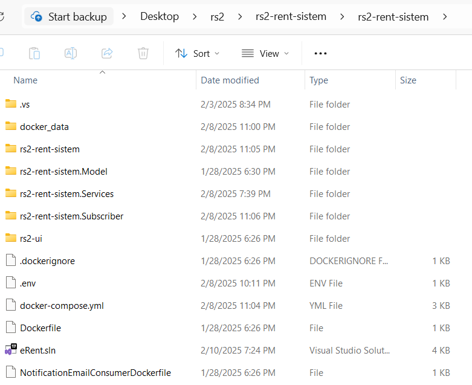
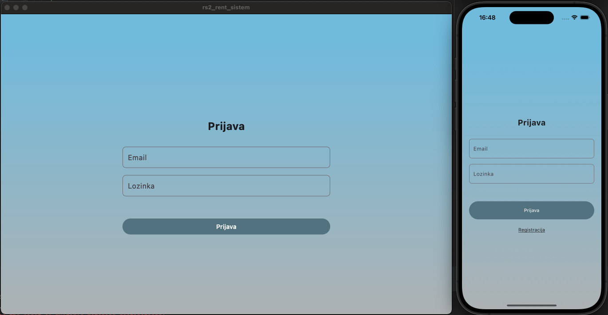
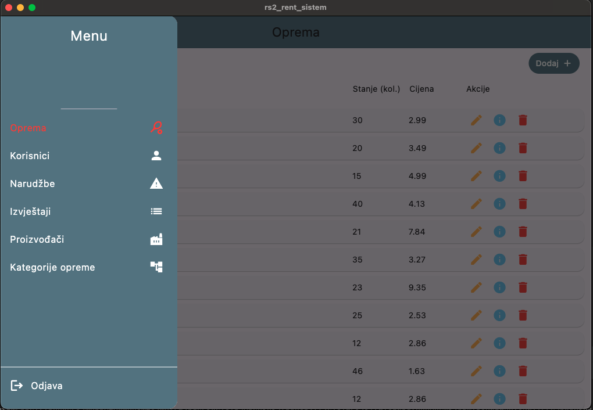
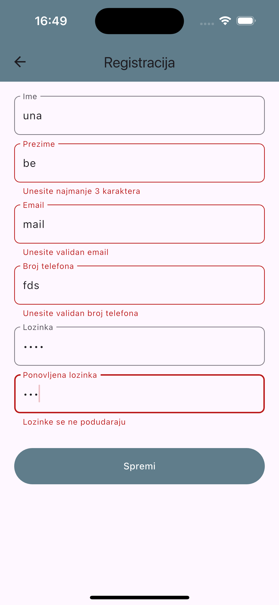
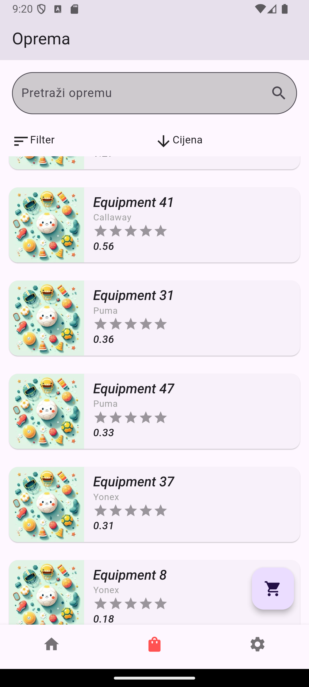
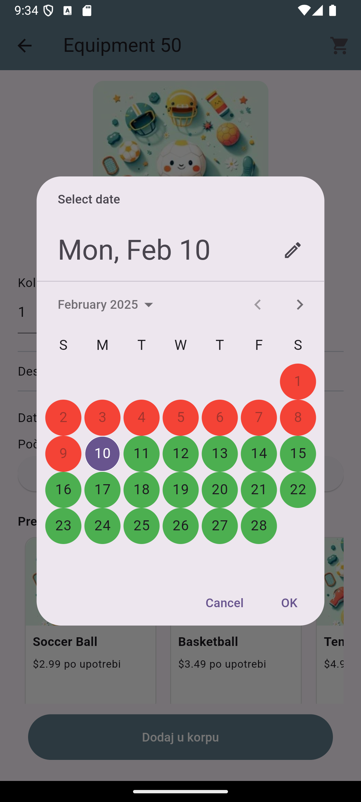
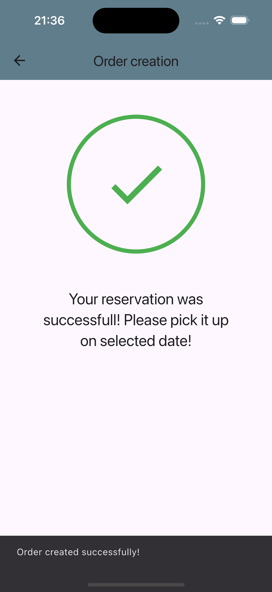
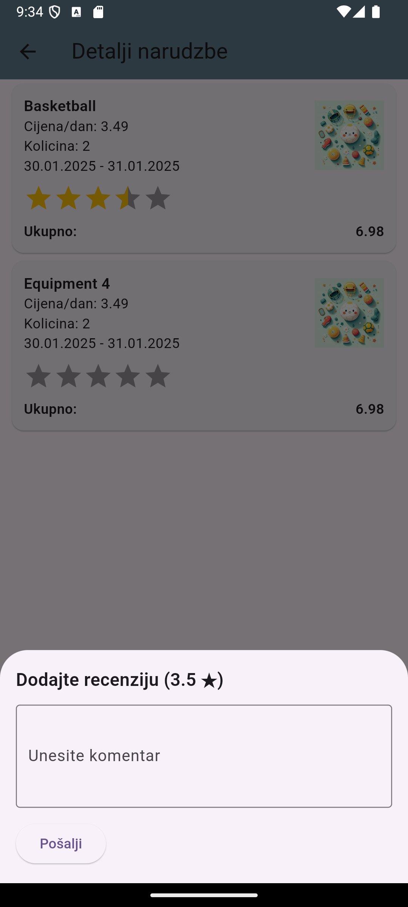

Pokretanje aplikacije:
U direktoriju rs2-rent-sistem pokrenuti komandu docker-compose up
  
Iz direktorija rs2-rent-sistem/rs2-ui/rs2_rent_sistem se pokrecu i mobilna i desktop aplikacija. U aplikaciji je
implementirana provjera na login-u, kako bi korisnik sa ispravnom rolom koristio ispravnu platformu.  
Api url je moguce definisati kroz komandu za pokretanje aplikacije, a trenutno je podesen u skladu sa docker adresom i
portom.  

Debug build-ovi mobilne i desktop aplikacije su dostupni u fajlu https://github.com/unaBelko/rs2-rent-sistem/blob/master/fit-build-2025-02-12.zip , koji je prvo potrebno un-zipovati.

Pokretanje Windows aplikacije: flutter run -d windows --dart-define=API_BASE_URL=http://localhost:5119/api/ ili flutter
run -d windows

Pokretanje Android aplikacije na emulatoru: flutter run -d emulator-5554
--dart-define=API_BASE_URL=http://10.0.2.2:5119/api/

Prijava za desktop app: una.belko+radnik@edu.fit.ba test123  
Prijava za mobile app: una.belko+shopping@edu.fit.ba test123  
Screenshots:

## Screenshots

### Desktop i mobile aplikacija

### Desktop meni

### Registracija - validacija

### Prikaz opreme u mobilnoj aplikaciji

### Dodavanje opreme u korpu

### Uspjesna rezervacija

### Review narudzbe

